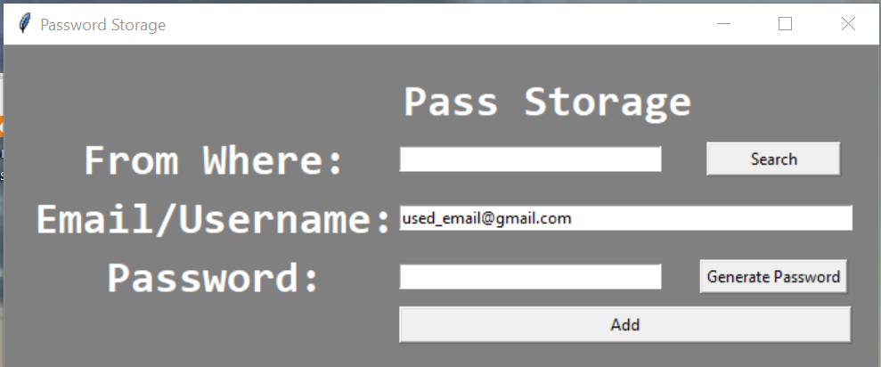
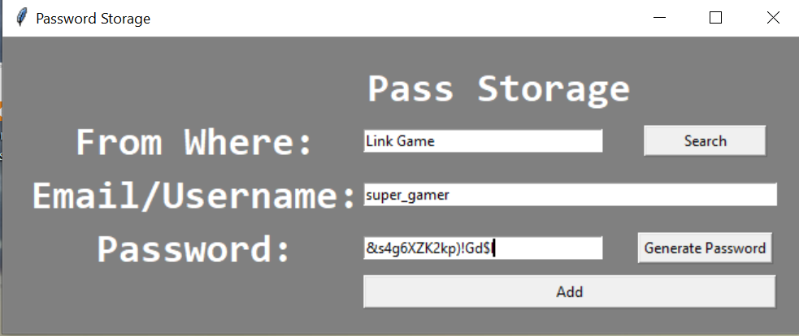
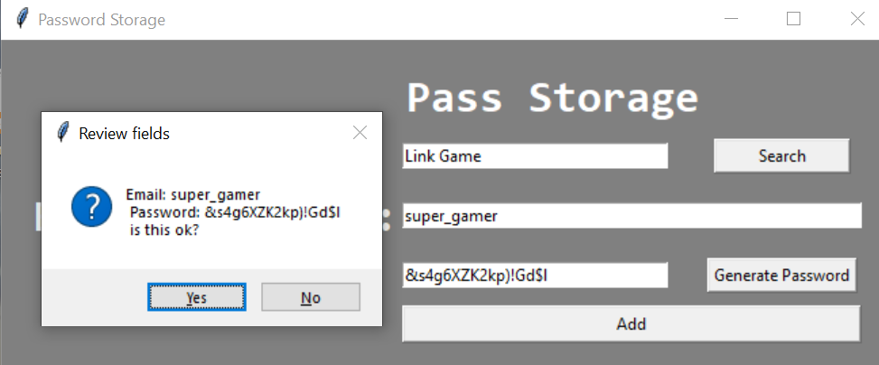
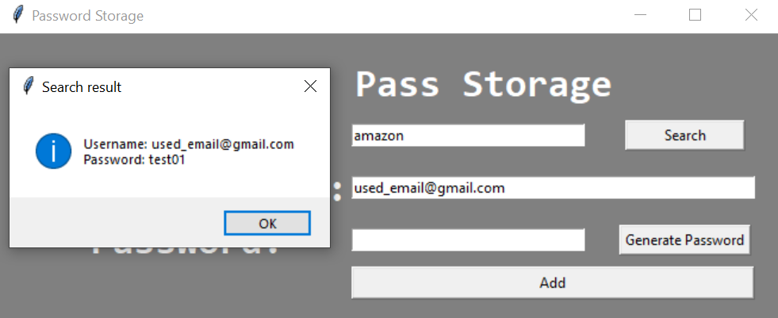

# Password Vault Archive
Here I hold the old/archived versions of the program.  
This is useful to show how it changed.

## Example of output in V0
Landing page:  

  
New Password:  
Note suggestion of password.  

Add password:  

Search password:  
Note, you only need to use From Where field to retrieve the user and password.  

## Author and Licence
**[Juan Carcedo](https://github.com/JuanCarcedo)**  
2022 Copyright © - Licence [MIT](https://github.com/JuanCarcedo/jca-python-projects/blob/main/LICENSE.txt)
